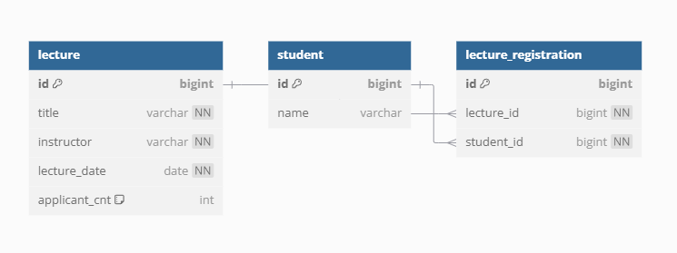

# 특강 신청 서비스 DB 설계

저는 특강 신청 서비스는 다음의 3가지 주요 테이블로 구성하였습니다.

테이블들의 관계를 설정은 하나의 강의는 여러 사용자가 신청 가능하며, 하나의 사용자는 중복되지 않은 여러 강의를 신청 할 수 있습니다.

이 다대다 관계는 LectureRegistration 테이블을 통해 관리됩니다.

- Lecture -> LectureRegistration (1:N)
- Student -> LectureRegistration (1:N)

---

## ERD 구조



---

## Lecture 테이블

특강 정보를 저장하는 테이블입니다.

특강 제목, 강연자, 특강 날짜, 정원을 관리하며 정원의 기본값은 최대 수용 인원인 30으로 설정하였습니다.

날짜를 신청 날짜와 신청 마감 날짜로 나누는 부분도 보았고 고민을 하였는데, 기준을 '신청'으로 하지 않고 '특강 날짜'로 잡아서 특강 날짜(lecture_date)로 하였습니다.

```sql
CREATE TABLE lecture
(
    id            BIGINT AUTO_INCREMENT PRIMARY KEY,
    title         VARCHAR(255) NOT NULL,
    instructor    VARCHAR(100) NOT NULL,
    lecture_date  DATE         NOT NULL,
    applicant_cnt INT          NOT NULL DEFAULT 0
);
```

## Student 테이블

사용자 정보를 저장하는 테이블입니다.

각 사용자는 고유한 id와 name(사용자가 선택 가능)로 관리합니다.

```sql 
CREATE TABLE student
(
    id   BIGINT AUTO_INCREMENT PRIMARY KEY,
    name VARCHAR(100) NOT NULL
);
```

## LectureRegistration 테이블

강의 신청 정보를 저장하는 테이블입니다.

사용자와 강의 간의 관계를 관리하며, 동일 강의에 대해 동일 사용자가 중복 신청하지 못하도록 제약 조건을 추가하였습니다.
lecture_id와 student_id 각각 Lecture와 Student 테이블의 외래 키입니다.

* 논리적으로 외래 키 관계가 정의되어 있지만, 물리적 테이블에서는 외래 키 설정을 하지 않았습니다.

```sql
CREATE TABLE lecture_registration
(
    id         BIGINT AUTO_INCREMENT PRIMARY KEY,
    lecture_id BIGINT NOT NULL,
    student_id BIGINT NOT NULL,
    UNIQUE (lecture_id, student_id),
    FOREIGN KEY (lecture_id) REFERENCES lecture (id) ON DELETE CASCADE,
    FOREIGN KEY (student_id) REFERENCES student (id) ON DELETE CASCADE
);
```